# Quorvium Architecture

## Purpose
This document describes Quorvium's current runtime architecture, component boundaries, and key data flows.

## Related Decisions
- [`ADR-001-PERSISTENT-DATASTORE.md`](./adr/ADR-001-PERSISTENT-DATASTORE.md): persistent datastore selection for real-time collaboration workload.

## System Context
```text
Browser Client (React + Vite)
  |- REST calls (HTTP)
  |- Realtime events (Socket.IO)
  v
API Service (Express + Socket.IO)
  |- Auth verification (Google OAuth2)
  |- Board + note CRUD
  v
Storage Adapter (JSON file or Cloud Firestore)
```

## Architecture Diagrams

Regenerate SVGs from Mermaid sources with:

```sh
bash docs/architecture/diagrams/render-diagrams.sh
```

### Runtime (Staging)

Source: [`docs/architecture/diagrams/runtime-staging.mmd`](./diagrams/runtime-staging.mmd)

### Artifact Promotion Flow (Client + API)

Source: [`docs/architecture/diagrams/artifact-promotion.mmd`](./diagrams/artifact-promotion.mmd)

## Runtime Topology
### Local Development
- Client runs on `http://localhost:5173`.
- API + Socket.IO run on `http://localhost:4000`.
- Board state persists to `server/data/boards.json` unless `DATA_DIR` overrides location.

### Staging Deployment
- API container runs on Cloud Run.
- Client static bundle is deployed to a Cloud Storage bucket and served through an external HTTP(S) load balancer (`staging.quorvium.com`) with managed TLS and HTTP->HTTPS redirect.
- CI/CD pipeline is defined in `.github/workflows/ci.yml`.
- Terraform under `infra/staging/` provisions baseline staging cloud resources and related IAM/secrets plumbing.

## Component Architecture
### Client (`client/`)
- Entry point: `src/main.tsx`.
- Routing: `BrowserRouter` or `HashRouter` selected by `VITE_ROUTER_MODE` (or storage-host fallback).
- Authentication state in `src/state/auth.tsx` stores active user in `localStorage` (`quorvium:user`).
- Guests are generated client-side; Google auth is verified by the API.
- API client: `src/lib/api.ts` (Axios, base URL resolved from runtime config first, then build-time fallback).
- Runtime config file: `runtime-config.js` is loaded before app bootstrap and supplies deploy-time values (`apiBaseUrl`, OAuth client/redirect, router mode, app version) without rebuilding frontend assets.
- Product version: rendered in the footer so each deployed build is identifiable.
- Realtime client: `src/lib/socket.ts` uses websocket transport and joins board rooms.

### API Server (`server/`)
- Entry point: `src/index.ts`.
- Transport stack: Express HTTP + Socket.IO on shared HTTP server.
- CORS origin comes from `CLIENT_ORIGIN`.
- REST routes include `POST /api/auth/verify`, `POST /api/boards`, `GET /api/boards?ownerId=...`, `GET /api/boards/:boardId`, and `DELETE /api/boards/:boardId`.
- Validation uses Zod schemas in route/socket handlers.

### Realtime Layer (`server/src/socket.ts`)
- `board:join`: joins board room and emits full board state.
- `note:create`: persists note and broadcasts `note:created`.
- `note:update`: persists patch and broadcasts `note:updated`.
- `note:delete`: removes note and broadcasts `note:deleted`.
- Ack callbacks return `{ ok: true }` or `{ ok: false, error }`.

### Persistence Layer (`server/src/store/boardStore.ts`)
- Persistence is selected through a store adapter at startup (`file` or `firestore`).
- `file` mode hydrates an in-memory map from JSON and writes mutations back to disk.
- Default file location is `<repo>/server/data/boards.json` for local/dev.
- In Cloud Run, `DATA_DIR` is used for `file` mode (workflow sets `/tmp/quorvium-data`, ephemeral).
- Staging is configured to run `firestore` mode for durable multi-instance persistence.

### Persistent Datastore Capability
- Storage backend is selected by `DATA_STORE`.
- `DATA_STORE=file` (default): existing JSON-file adapter.
- `DATA_STORE=firestore`: Cloud Firestore adapter using:
  - `boards/{boardId}`
  - `boards/{boardId}/notes/{noteId}`
- Optional Firestore settings: `FIRESTORE_PROJECT_ID`, `FIRESTORE_DATABASE_ID`, `FIRESTORE_BOARDS_COLLECTION`.

## Data Model
Core server types are defined in `server/src/types.ts`:
- `Participant`: user identity metadata.
- `StickyNote`: positioned note with content, color, timestamps, author.
- `Board`: owner metadata plus note dictionary.

## Authentication and Token Handling
- Google OAuth env inputs (server): `GOOGLE_CLIENT_ID`, `GOOGLE_CLIENT_SECRET`, `GOOGLE_REDIRECT_URI`.
- Google OAuth env inputs (client): `VITE_GOOGLE_CLIENT_ID`, `VITE_GOOGLE_REDIRECT_URI`.
- `/api/auth/verify` supports Google authorization code exchange and ID token verification.
- Server writes Google tokens to HTTP-only cookies: `quorvium_google_access` and `quorvium_google_refresh`.
- Cookies are `secure` in production and `SameSite=Lax`.

## Delivery and Operations
- CI workflow (`.github/workflows/ci.yml`) runs lint, typecheck, tests, and build on PRs and pushes to `main`.
- On `main`, CI computes `PRODUCT_VERSION` (`YYYY.MM.DD.SEQ.commitsha`, where `SEQ` is the GitHub run number), packages one immutable client release artifact (`client-<version>.tar.gz` + manifest checksum), tags/pushes API images by commit SHA and product version, and deploys that exact client artifact to staging (no client rebuild in deploy stage).
- Release promotion workflow (`.github/workflows/promote-release-production.yml`) promotes both API image and client artifact by `product_version`, with digest/checksum parity checks when publishing to production.
- Infra code in `infra/staging/*.tf` defines staging cloud resources and supporting IAM/secrets.

## Current Constraints
- File-store mode remains ephemeral on Cloud Run restart/rollout.
- Full realtime multi-instance consistency still relies on current Socket.IO topology decisions (single process assumptions).
- OAuth token refresh endpoint is not yet implemented.
- Board access uses share-link model; fine-grained board authorization is pending.
