# AI Native SDLC: A Case Study

## Table of Contents

- [Introduction](#introduction)
- [Why This Story Matters](#why-this-story-matters)
- [Product Context: Quorvium](#product-context-quorvium)
- [The AI-Native SDLC Model](#the-ai-native-sdlc-model)
- [SDLC Phases in Quorvium](#sdlc-phases-in-quorvium)
  - [Plan](#plan)
  - [Design](#design)
  - [Build](#build)
  - [Test](#test)
  - [Review](#review)
  - [Document](#document)
  - [Deploy and Maintain](#deploy-and-maintain)
- [What Worked and What Required Guardrails](#what-worked-and-what-required-guardrails)
- [Closing](#closing)

## Introduction

AI native SDLC opens up a major leap in how teams deliver software, because it can accelerate far more than coding: planning, design, testing, review, documentation, and day-to-day operations. In practice, that means higher team productivity, shorter cycle time from idea to feature delivery, and faster time-to-market while still holding a high bar for production quality.

To assess that potential realistically, I wanted to build a real product from concept to production, not a narrow prototype. The goal was to evaluate full-lifecycle capability, limits, and quality guardrails in one continuous delivery journey.

That is where Quorvium comes in. Quorvium is a collaboration app where teams brainstorm ideas together in real time. This case study shows how AI was used from the first idea to a live product.

## Why This Story Matters

Most discussions on AI native SDLC focus on isolated coding gains. This case study is different: it follows one product across the full lifecycle and keeps quality gates visible at each stage.

The core takeaway is practical: AI can take on more first-pass delivery work, but engineers must remain accountable for decision quality, risk management, and final production outcomes.

## Product Context: Quorvium

Quorvium is a real-time collaboration product with:

- Frontend (React + Vite)
- Backend API (Express + Socket.IO)
- Google sign-in (OAuth 2.0)
- Collaboration model (shared board links)
- Delivery pipeline (Cloud Run + GitHub Actions)
- Persistence (Firestore)

Because it touches product, app code, infra, CI/CD, and operations, it was a strong end-to-end case study for AI native SDLC.

## The AI-Native SDLC Model

The model below from OpenAI became my working framework.

Model reference: [Codex for Software Engineers (OpenAI Academy, March 13, 2026)](https://academy.openai.com/home/videos/codex-for-software-engineers-2026-03-13).  

## SDLC Phases in Quorvium

### Plan

Agent contribution:

- expand rough ideas into structured tickets
- identify dependencies and sequencing risks
- draft acceptance criteria and non-goals

Engineer ownership:

- set business priority
- define tradeoff boundaries
- approve final scope

Quorvium examples:

- early feature breakdown into technical and feature backlogs
- phased scope decisions for live rollout

### Design

Agent contribution:

- produce first-pass architecture options
- scaffold diagram text and ADR drafts
- compare alternatives with explicit pros/cons

Engineer ownership:

- choose architecture based on constraints
- reject weak assumptions
- lock decisions in ADRs

Quorvium examples:

- persistent datastore decision flow
- architecture diagram updates across infra and promotion changes

### Build

Agent contribution:

- scaffold implementation
- perform repetitive refactors
- propagate consistent changes across files

Engineer ownership:

- enforce behavior correctness
- enforce security and ownership rules
- keep diffs scoped and coherent

Quorvium examples:

- board rename capability with owner-only controls
- product version model surfaced in UI and release workflows
- file-to-Firestore store adapter implementation

### Test

Agent contribution:

- propose test cases from changed code and specs
- update affected tests after behavior changes
- suggest negative/edge-path coverage

Engineer ownership:

- verify test intent quality
- decide critical-path coverage requirements
- block merge when risk remains untested

Quorvium examples:

- keeping server integration and client tests aligned with feature behavior
- CI-parity checks before push

### Review

Agent contribution:

- first-pass review for obvious defects and consistency
- detect stale references after refactors
- highlight likely regressions

Engineer ownership:

- final approval
- architectural quality gate
- release risk call

Quorvium examples:

- doc/code/workflow alignment checks before large commits
- environment-scoped infra refactor validation

### Document

Agent contribution:

- generate first draft docs quickly
- update runbooks/spec/architecture from code diffs
- draft backlog items and issue text

Engineer ownership:

- confirm technical accuracy
- keep wording aligned with real operations
- maintain decision history quality

Quorvium examples:

- operations docs for secrets bootstrap and live environment setup
- architecture + production-readiness updates after infra changes

### Deploy and Maintain

Agent contribution:

- surface deployment/config drift signals
- assist with rollout checklist updates
- triage likely causes from logs and workflow output

Engineer ownership:

- incident handling
- rollback and recovery decisions
- production safety approvals

Quorvium examples:

- Firestore provisioning and secret enablement for live environment
- promotion workflow updates for API image + client artifact integrity

## What Worked and What Required Guardrails

What worked:

1. Faster end-to-end iteration, not just faster coding.
2. Better documentation freshness with less manual effort.
3. More explicit decision-making through ADRs and runbooks.
4. Higher consistency across code, workflows, and operations docs.

What required guardrails:

1. AI can produce plausible but context-misaligned recommendations.
2. Broad prompts can generate oversized, noisy diffs.
3. Infra suggestions can miss environment state/history.
4. Velocity can hide risk unless quality gates are enforced.

Operating principles:

1. Human-owned architecture and security decisions.
2. Small commits with clear intent.
3. CI-parity checks before merge/push.
4. Docs updated in the same change as code/infra.
5. Issue/backlog traceability for major changes.

## Closing

AI did not replace engineering responsibility in Quorvium. It increased leverage.

The practical pattern is to let AI do more first-pass execution while engineers retain final authority on correctness, design quality, and operational risk. That is what made the approach useful from concept through production readiness.
